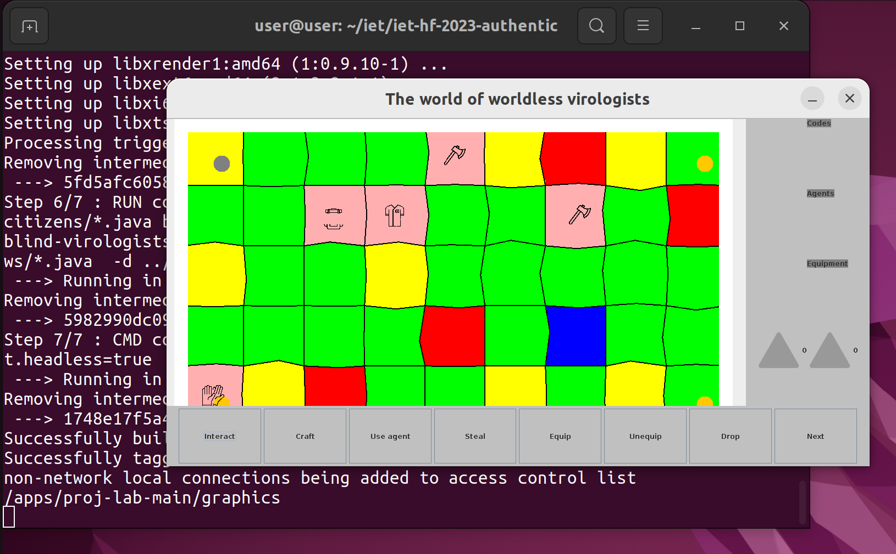

# Feladat: Az applikáció konténerizálása Docker segítségével

## Kiindulás

### Az applikáció Dockerizálásához az alábbi feladatokat kellett elvégeznünk:

- Docker telepítése
- Dockerfile létrehozása és megírása
- X11 szerver beállítása GUI megjelenítéshez
- Shell script megírása a telepítés megkönnyítése érdekében

## Dockerfile

A `Dockerfile` `openjdk-11`-es image-et használ. Telepíti a GUI-hoz szükséges `X11` könyvtárakat, majd buildeli a java-s alkalmazást `javac` segítségével. Ezen események a build alatt történnek, a játék futtatása a `CMD` paranccsal a konténer futtatásakor történik meg.

## Shell script

A `docker_run.sh` a build-et és a futtatást automatikusan elvégzi, a konténer futásának idejére engedélyezi az `X11` szervernek a helyi kapcsolatokat, hogy a konténerben futó java alkalmazás tudjon csatlakozni a host géphez, majd ez a futás után ismét letiltásra kerül.

## Kihívások

A `Dockerfile`-nak alapesetben működnie kéne `Windows` rendszerben is, viszont itt kézzel kell telepíteni és konfigurálni az `X11` szervert, amely nekünk nem sikerült, így `Linux` rendszerre váltottunk, amely az elvárt működést hozta.

### A konténerben futó alkalmazás:

