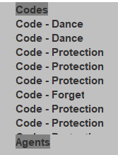
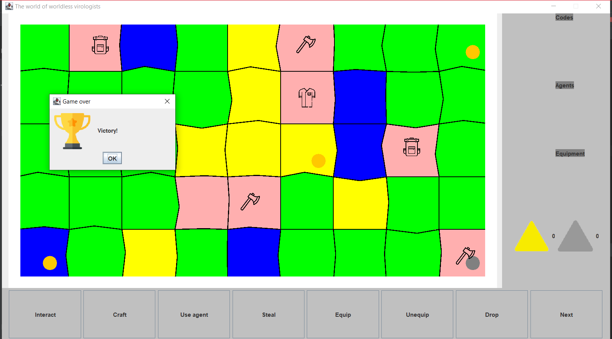
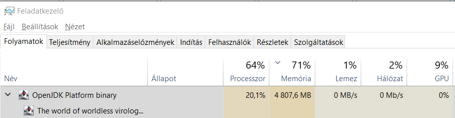

# Manuális tesztelés

## Tervek

A tesztek során a következő főbb funkciókat teszteljük:

- Mozgás
- Általános UI funkciók
- Interakció a mezőkkel
    - Üres
    - Labor
    - Raktár
    - Fertőzött labor
    - Óvóhely
- Tárgyak használata
    - Köpeny
    - Táska
    - Kesztyű
    - Balta
- Interakció más játékosokkal
    - Lopás
    - Ágens használata
        - Felejtés
        - Kábítás
        - Immunitás
        - Tánc
- Játék vége

## Végrehajtás

A teszteket párban végezzük el, a tesztek során felmerülő nem várt problémákat dokumentáljuk és hozzájuk további teszteket tervezünk. A tesztelés során a használhatóságra is teszünk észrevételeket.

## Eredmények

### Mozgás

A mozgás általában helyesen működik, viszont a kiválasztott mezőről nincs semmilyen visszajelzés. A program helyesen kezeli a kiválasztott mező módosítását, mindig az utolsó választás jut érvényre. A konzolban ilyenkor debug információ is megjelenik, aminek a rendes programban nem kéne. Ha két játékos kerül egy mezőre, akkor eltakarják egymást.

### Általános UI funkciók

A funkciók működnek, a UI méretezése viszont sok esetben hibás. A kezdőképernyőn a cím nem fér ki, az oldalsó menüben, ha túl sok elem kerül a listába, akkor az alsó elemek nem látszanak.

A Use Agent felugró ablaka hibásan lett méretezve.

### Interakció a mezőkkel

Az interakció minden mező esetében helyesen működik, de sokszor nincs visszajelzés a mező állapotáról. A raktárban nem látszódik, hogy van-e még benne anyag.

### Tárgyak használata

**Köpeny**

Működik, eltávolítja az éppen aktív káros effekteket.

**Kesztyű**

Az ágens használatakor a célpont kiválasztása nem működik, ezért ezt nem lehetett tesztelni.

**Táska**

Működik, de nincs semmilyen visszajelzés a maximális anyagmennyiségről.

**Balta**

Nem működik, nincs hatása. Kivételt nem kapunk.

### Interakció más játékosokkal
    
**Lopás**

A kábítás nem működik, ez feltétele lenne a lopásnak, ezért ezt nem lehetett tesztelni.

**Ágens használata**

Az ágens kiválasztásakor mindig NullPointerExceptiont kapunk.

### Játék vége

A játék sikeresen véget ér, ha valaki megtanulja az össze kódot. A játék csak azután ér véget, ha az adott kör is véget ért, ami nem túl intuitív.

### Teljesítményproblémák

A program ~15 percnyi játék után nagyon belassul, az új kör indítása több másodpercing tart. A memóriahasználat is irreálisan magas.

