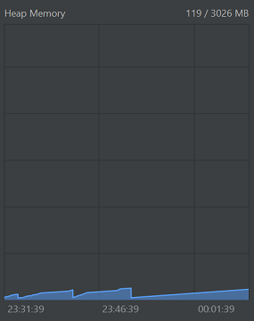

# Nem-funkcionális jellemzők vizsgálata

## Teljesítmény

A program teljesítményét 30 percen keresztül figyeltük az alábbi szempontok szerint:
- CPU
- Heap Memory
- Threads
- Non-Heap Memory

**CPU:** Általánosságban elmondható, hogy az erőforrásigénye alacsony volt, csak akkor növekedett, amikor a program nagyobb erőforrásokat igényelt. Az eredmények szerint az idle állapotban a CPU használata csak 1-2% volt, enyhe interakciók esetén pedig 5-10%. Csak néha emelkedett meg 25%-ra, amikor felugró ablakok jöttek elő.

Ezek az eredmények arra utalnak, hogy a program jól optimalizált és hatékonyan használja az erőforrásokat. Az alacsony CPU használat azt jelzi, hogy a program minimális erőforrást igényel, ami csökkenti a felhasználók számítógépeinek terhelését. Ezáltal a program kényelmesen és hatékonyan használható lesz a felhasználók számára.

**Heap Memory:**  A megfigyelés alatt nem tapasztaltunk memóriaszivárgást. A heap mérete akkor nő, amikor új referencia típusú objektumokat allokálunk, és csökken, amikor ezeket a garbage collector elvégzi. A GC átlagosan 120 MB memóriát takarított fel. Az eredmények alapján megállapítható, hogy a programnak nincs nagyobb memóriaigénye, ami azt jelenti, hogy a felhasználók számítógépeinek terhelése minimális lesz.

**Threads:** Mivel a program egy szálra lett megírva, így láthatjuk, hogy ténylegesen egy főszálon fut a többi pirossal jelzett szál háttérfolyamatokat mutatja, mint például a GC és ActionListener.

**Non-Heap Memory:** Ez a típusú memória arra szolgál, hogy tároljon JVM objektumokat, amelyek szükségesek a JVM működéséhez.

## Stressz teszt

1. fázis: A https://www.murgee.com/random-mouse-clicker/ alkalmazást setupoltuk, hogy a UI felületen 1ms-ként véletlenszerűen kattintgatson, majd hagytuk futni körülbelül 10 percig.

2. fázis: Az IntelliJ Profiler-ben elemeztük az eredményeket és azt tapasztaltuk, hogy számottevő terhelésnövekedés nem jelentkezett.

3. fázis: Továbbá csak az Interact gombra alaklmazva a fentebb leírtakat, azt tapasztaltuk hogy enyhe terhelésnövekedés következett be.

## Használhatóság

1. A játék megnyitása után egy start game ablak ugrik fel, ami tovább vezet magára a játékra, ezen az oldalon semmilyen beállítást nem lehet végrehajtni, ezért ez a felugró ablak felesleges.

2. A játék alapból nem full-screen és nem is lehet kitenni full-screen-be, továbbá átméretezni sem lehet semmilyen módon. Ez a felhasználó számára rendkívül zavaró lehet.

3. A játékmenetét semmi nem magyarázza és nem egyáltalán nem egyértelmű, hogy milyen interakciókat kellene végrehajtani, ahoz hogy megfelelően használjuk a játékot.

4. A kiválasztott mezőt semmilyen módon nem jelöli, ezt a felhasználó emlékezetére bízza, amely egy mellényomás után teljesen felboríthatja a játék menetét.

5. Bizonyos szerencsétlen inputok hatására a játékosok teljesen beragadthatnak egy mezőre, ahonnan bizonyos szerencsés inputok hatására kijuthat.

6. Miután a kezdeti nehézségeken túljutottunk, a játékkal való ötödik perc körül a felhasználó elkezdhet némi frusztráltságot érezni, mivel a játék nem nyújt semmilyen pozitív élményt.

## Megbízhatóság

A program működése nem megbízható, mivel egy azonos input sorozatot más időben kiadva nem ugyanazt az eredményt kapjuk. 

Néhány esetben a program teljesen unresponsive-vá válhat és emiatt a játék állapotát elveszíthetjük, mivel nem tudjuk folytatni a játékot.

## Biztonság

Mivel a program nem dolgozik szenzitív adatokkal (Authentication details, Personal Information, Financial Information, Personal Communications, stb...), ezért nem is lettek biztonsági funkciók implementálva.