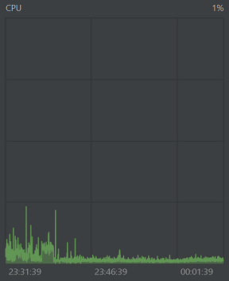

# Nem-funkcionális jellemzők vizsgálata

## Teljesítmény

A program teljesítményét 30 percen keresztül figyeltük az alábbi szempontok szerint:
- CPU
- Heap Memory
- Threads
- Non-Heap Memory

**CPU:** Általánosságban elmondható, hogy az erőforrásigénye alacsony volt, csak akkor növekedett, amikor a program nagyobb erőforrásokat igényelt. Az eredmények szerint az idle állapotban a CPU használata csak 1-2% volt, enyhe interakciók esetén pedig 5-10%. Csak néha emelkedett meg 25%-ra, amikor felugró ablakok jöttek elő.

Ezek az eredmények arra utalnak, hogy a program jól optimalizált és hatékonyan használja az erőforrásokat. Az alacsony CPU használat azt jelzi, hogy a program minimális erőforrást igényel, ami csökkenti a felhasználók számítógépeinek terhelését. Ezáltal a program kényelmesen és hatékonyan használható lesz a felhasználók számára.

**Heap Memory:**  A megfigyelés alatt nem tapasztaltunk memóriaszivárgást. A heap mérete akkor nő, amikor új referencia típusú objektumokat allokálunk, és csökken, amikor ezeket a garbage collector elvégzi. A GC átlagosan 120 MB memóriát takarított fel. Az eredmények alapján megállapítható, hogy a programnak nincs nagyobb memóriaigénye, ami azt jelenti, hogy a felhasználók számítógépeinek terhelése minimális lesz.

**Threads:** Mivel a program egy szálra lett megírva, így láthatjuk, hogy ténylegesen egy főszálon fut a többi pirossal jelzett szál háttérfolyamatokat mutatja, mint például a GC és ActionListener.

**Non-Heap Memory:** Ez a típusú memória arra szolgál, hogy tároljon JVM objektumokat, amelyek szükségesek a JVM működéséhez.

